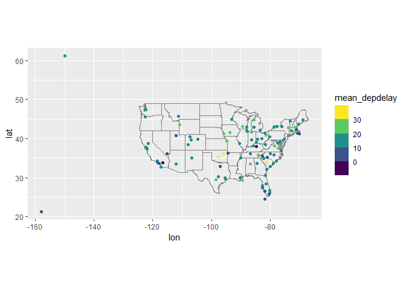
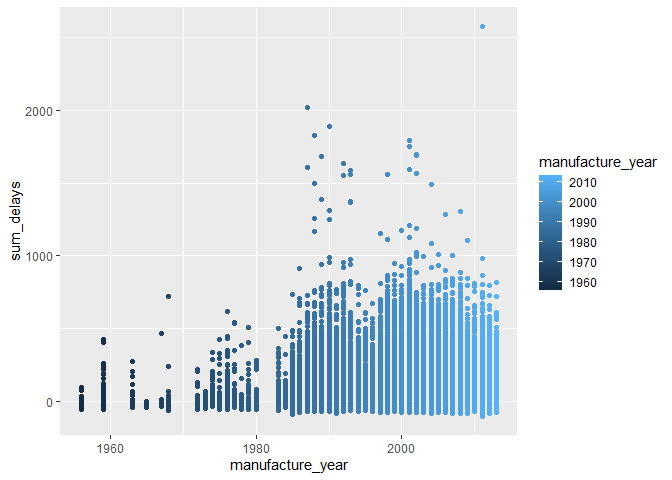

Lesson 12
================

We’re working on binding, mutating, and filtering between multiple data
tables

``` r
library(nycflights13)
```

    ## Warning: package 'nycflights13' was built under R version 4.5.3

``` r
library(tidyverse)
```

    ## Warning: package 'tidyverse' was built under R version 4.5.3

    ## Warning: package 'dplyr' was built under R version 4.5.3

    ## ── Attaching core tidyverse packages ──────────────────────── tidyverse 2.0.0 ──
    ## ✔ dplyr     1.2.1     ✔ readr     2.1.6
    ## ✔ forcats   1.0.1     ✔ stringr   1.6.0
    ## ✔ ggplot2   4.0.2     ✔ tibble    3.3.1
    ## ✔ lubridate 1.9.4     ✔ tidyr     1.3.2
    ## ✔ purrr     1.2.1     
    ## ── Conflicts ────────────────────────────────────────── tidyverse_conflicts() ──
    ## ✖ dplyr::filter() masks stats::filter()
    ## ✖ dplyr::lag()    masks stats::lag()
    ## ℹ Use the conflicted package (<http://conflicted.r-lib.org/>) to force all conflicts to become errors

``` r
library(dplyr)
nycflights13::flights
```

    ## # A tibble: 336,776 × 19
    ##     year month   day dep_time sched_dep_time dep_delay arr_time sched_arr_time
    ##    <int> <int> <int>    <int>          <int>     <dbl>    <int>          <int>
    ##  1  2013     1     1      517            515         2      830            819
    ##  2  2013     1     1      533            529         4      850            830
    ##  3  2013     1     1      542            540         2      923            850
    ##  4  2013     1     1      544            545        -1     1004           1022
    ##  5  2013     1     1      554            600        -6      812            837
    ##  6  2013     1     1      554            558        -4      740            728
    ##  7  2013     1     1      555            600        -5      913            854
    ##  8  2013     1     1      557            600        -3      709            723
    ##  9  2013     1     1      557            600        -3      838            846
    ## 10  2013     1     1      558            600        -2      753            745
    ## # ℹ 336,766 more rows
    ## # ℹ 11 more variables: arr_delay <dbl>, carrier <chr>, flight <int>,
    ## #   tailnum <chr>, origin <chr>, dest <chr>, air_time <dbl>, distance <dbl>,
    ## #   hour <dbl>, minute <dbl>, time_hour <dttm>

Imagine you wanted to draw the route each plane flies from its origin to
its destination. What variables would you need? What tables would you
need to combine? (This is in reference to the nycflights dataset).

I’m thinking you’d need the lat and long data from the “airports” data
set and the you’d join with flights by origin, but you also need the lat
and long to correspond to the destination. In the datasheet “airports”
we have the latitude and longitude of each airport, so how do we show it
for both the origin and the destination?

To practice the `join` functions, subset the `flights` dataframe as
follows

The most commonly used join is the left join. Use this whenever you look
up additional data from another table, because it preserves the original
observations even when there isn’t a match. The left join should be your
default.

\#trying to compute average delay by destination then join on the
`airports` dataframe to show spatial distribution of delays.

``` r
delays <- flights %>% 
  select(dep_delay, arr_delay, dest, origin, tailnum) %>% 
  group_by(dest) %>% 
  summarize(mean_depdelay = mean(dep_delay, na.rm=TRUE), mean_arrdelay = mean(arr_delay, na.rm=TRUE))

delays %>% 
  inner_join(airports, c("dest"="faa")) %>%  
  ggplot(aes(lon,lat,color=mean_depdelay))+
  scale_color_viridis_b()+
  annotation_borders("state")+
  geom_point()+
  coord_quickmap()
```

<!-- -->

``` r
#Add latitude and longitude data to the flights tibble
Locations <- flights %>% 
  select(dest, origin, year, month, day, dep_time) %>% 
  full_join(airports, c("dest"="faa")) %>% 
  left_join(airports, c("origin"="faa")) 

Locations %>% 
  rename(dest_lat=lat.x, dest_long=lon.x, origin_lat=lat.y, origin_lon=lon.y)
```

    ## # A tibble: 338,133 × 20
    ##    dest  origin  year month   day dep_time name.x dest_lat dest_long alt.x  tz.x
    ##    <chr> <chr>  <int> <int> <int>    <int> <chr>     <dbl>     <dbl> <dbl> <dbl>
    ##  1 IAH   EWR     2013     1     1      517 Georg…     30.0     -95.3    97    -6
    ##  2 IAH   LGA     2013     1     1      533 Georg…     30.0     -95.3    97    -6
    ##  3 MIA   JFK     2013     1     1      542 Miami…     25.8     -80.3     8    -5
    ##  4 BQN   JFK     2013     1     1      544 <NA>       NA        NA      NA    NA
    ##  5 ATL   LGA     2013     1     1      554 Harts…     33.6     -84.4  1026    -5
    ##  6 ORD   EWR     2013     1     1      554 Chica…     42.0     -87.9   668    -6
    ##  7 FLL   EWR     2013     1     1      555 Fort …     26.1     -80.2     9    -5
    ##  8 IAD   LGA     2013     1     1      557 Washi…     38.9     -77.5   313    -5
    ##  9 MCO   JFK     2013     1     1      557 Orlan…     28.4     -81.3    96    -5
    ## 10 ORD   LGA     2013     1     1      558 Chica…     42.0     -87.9   668    -6
    ## # ℹ 338,123 more rows
    ## # ℹ 9 more variables: dst.x <chr>, tzone.x <chr>, name.y <chr>,
    ## #   origin_lat <dbl>, origin_lon <dbl>, alt.y <dbl>, tz.y <dbl>, dst.y <chr>,
    ## #   tzone.y <chr>

``` r
View(Locations)
```

This technically works but it’s ugly/hard to read can you offer
guidance?

Is there a relationship between age of planes and their delays?

``` r
clean_planes <- planes %>% 
  select(tailnum, year) %>% 
  arrange(year) %>% 
  na.omit %>% 
   rename(manufacture_year=year)
```

``` r
total_delays <- flights %>% 
  mutate(sum_delays=dep_delay+arr_delay)
```

``` r
Age_delays <- total_delays %>%
  full_join(clean_planes, by= "tailnum") 

ggplot(data=Age_delays)+
  geom_point(mapping=aes(x = manufacture_year, y = sum_delays, color=manufacture_year))
```

    ## Warning: Removed 62923 rows containing missing values or values outside the scale range
    ## (`geom_point()`).

<!-- -->
